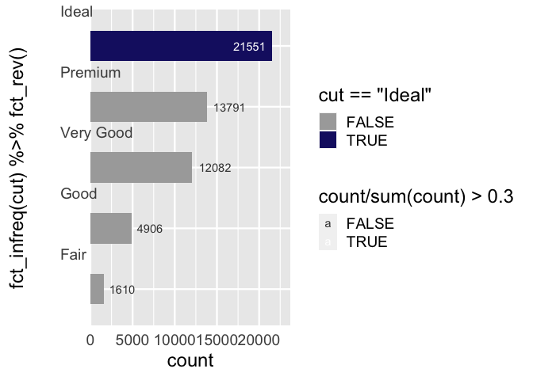

  - [ggbarlabs](#ggbarlabs)
  - [Part 1. Addressing a problem with new
    functionality](#part-1-addressing-a-problem-with-new-functionality)
      - [Describing problem](#describing-problem)
          - [bar charts are ubiquitous and can quickly communicate
            information…](#bar-charts-are-ubiquitous-and-can-quickly-communicate-information)
          - [… and bar plots can benefit from specificity of labeling
            …](#-and-bar-plots-can-benefit-from-specificity-of-labeling-)
          - [… but its a pain](#-but-its-a-pain)
      - [What
        if…`ggbarlabs::geom_barlab_count()`\!](#what-ifggbarlabsgeom_barlab_count)
          - [Proposed User interface](#proposed-user-interface)
      - [Composing functions to this
        end](#composing-functions-to-this-end)
          - [`geom_barlab_count()`](#geom_barlab_count)
          - [`geom_barlab_count_percent`](#geom_barlab_count_percent)
      - [Complementary functionality
        `ggbarlabs()`](#complementary-functionality-ggbarlabs)
      - [Build `defaults_ggbarlabs` and
        `ggbarlabs()`](#build-defaults_ggbarlabs-and-ggbarlabs)
          - [try it out](#try-it-out-1)
      - [Reflect. Acknowledge short comings, doubts, other good and
        pertanent
        work](#reflect-acknowledge-short-comings-doubts-other-good-and-pertanent-work)
  - [Part 2. Packaging and documentation 🚧
    ✅](#part-2-packaging-and-documentation--)

<!-- README.md is generated from README.Rmd. Please edit that file -->

# ggbarlabs

<!-- badges: start -->

<!-- badges: end -->

# Part 1. Addressing a problem with new functionality

## Describing problem

### bar charts are ubiquitous and can quickly communicate information…

``` r
library(ggplot2)
theme_set(theme_gray(18))
ggplot(mtcars) + 
  aes(x = am) + 
  geom_bar() 
```


``` r

p <- last_plot()
```

### … and bar plots can benefit from specificity of labeling …

Labeled bar chart is all the fast communication of traditional data
vizualization with all the specificity of a data table.

### … but its a pain

#### either precalc and use geom\_col + geom\_text

🤔 🚧 I’m too lazy to even provide an example.

#### or use verbose after\_stat…

##### first inspecting bar layer (stat\_count)

``` r
layer_data(last_plot(), 1)
#>    y count    prop x flipped_aes PANEL group ymin ymax  xmin xmax colour   fill
#> 1 19    19 0.59375 0       FALSE     1    -1    0   19 -0.45 0.45     NA grey35
#> 2 13    13 0.40625 1       FALSE     1    -1    0   13  0.55 1.45     NA grey35
#>   linewidth linetype alpha
#> 1       0.5        1    NA
#> 2       0.5        1    NA
```

##### then plot

using our knowledge of what data frame results when using StatCount,
refer to the computed var, count

``` r
# count column can be used via after_stat
p +
  geom_text(stat = StatCount, 
            aes(label = after_stat(count)), 
            vjust = -.7)
```


``` r

p + 
  geom_text(stat = StatCount, 
            aes(label = after_stat(
              paste0(round(100*count/sum(count), 1) ,"%")
              )), 
            vjust = -.7)
```


``` r

p + 
  geom_text(stat = StatCount, 
            aes(label = after_stat(
              paste0(count,"\n(",round(100*count/sum(count), 1) ,"%)")
              )), 
            vjust = -.5, lineheight = .8)
```


``` r

layer_data(last_plot(), 2)
#>         label  y count    prop x width flipped_aes PANEL group colour size
#> 1 19\n(59.4%) 19    19 0.59375 0   0.9       FALSE     1    -1  black 3.88
#> 2 13\n(40.6%) 13    13 0.40625 1   0.9       FALSE     1    -1  black 3.88
#>   angle hjust vjust alpha family fontface lineheight
#> 1     0   0.5  -0.5    NA               1        0.8
#> 2     0   0.5  -0.5    NA               1        0.8
```

## What if…`ggbarlabs::geom_barlab_count()`\!

### Proposed User interface

``` r
ggplot(mtcars) + 
  aes(x = am) + 
  geom_bar() + 
  geom_barlab_count()

ggplot(mtcars) + 
  aes(x = am) + 
  geom_bar() + 
  geom_barlab_count_percent()
```

## Composing functions to this end

### `geom_barlab_count()`

🤔 🚧 likely rewrite, creating new ggproto stat, maybe using
StatCount$compute as start point. This might resolve y label issue which
currently quotes ‘after\_stat()’. See test below.

June Choe, authored the first round ggdirect::geom\_text\_count and
ggdirect::geom\_text\_count\_percent, which proved super useful.

🚧 Main change below is to use vjust for y adjustment rather than
nudge\_y strategy… Any reason to go back? ‘you can use numbers outside
the range (0, 1), but it’s not recommended.’

``` r
#' geom_text_count
#' @description Add label which is the count.  Acts like geom_bar() but text label at the position of the top of the bar.
#'
#' @param vjust vertical justification, either a string (“top”, “middle”, “bottom”, “left”, “center”, “right”) or a number between 0 and 1; you can use numbers outside the range (0, 1), but it’s not recommended.
#' @param position Position adjustment, either as a string, or the result of a call to a position adjustment function. Cannot be jointly specified with nudge_x or nudge_y
#' @param ... Other arguments passed on to layer(). These are often aesthetics, used to set an aesthetic to a fixed value, like colour = "red" or size = 3. They may also be parameters to the paired geom/stat.
#'
#' @return
#' @export
#'
#' @examples
geom_barlab_count <- function(vjust = -0.15, position =
                              ggplot2::position_dodge2(width = .9,
                                                       preserve = "single"), ...){

  ggplot2::stat_count(geom = "text",
                      ggplot2::aes(label = ggplot2::after_stat(count)),
                      vjust = vjust,
                      position = position,
                      ...
  )

}
```

#### Test it out

🤔 🚧 Think about a new example, numeric as categories feels awkward

``` r
library(ggplot2)
ggplot(mtcars) +
   aes(x = factor(cyl)) +
   geom_bar(position = "dodge") +
   geom_barlab_count()
```


``` r

last_plot() + 
  aes(fill = factor(am))
```


### `geom_barlab_count_percent`

🤔 🚧 likely rewrite creating new ggproto stat object. Hopefully this
would allow greater customizability in terms of defining denominator

``` r
#' geom_barlab_count_percent
#' @description Add label which is the count as well as percentage.  Acts like geom_bar() but text label at the position of the top of the bar.  Percentage is calculated within facet panels.
#'
#' @param vjust vertical justification, either a string (“top”, “middle”, “bottom”, “left”, “center”, “right”) or a number between 0 and 1; you can use numbers outside the range (0, 1), but it’s not recommended.
#' @param lineheight single to double spacing is the idea here
#' @param position Position adjustment, either as a string, or the result of a call to a position adjustment function. Cannot be jointly specified with nudge_x or nudge_y
#' @param ... Other arguments passed on to layer(). These are often aesthetics, used to set an aesthetic to a fixed value, like colour = "red" or size = 3. They may also be parameters to the paired geom/stat.
#'
#' @return
#' @export
#'
#' @examples
geom_barlab_count_percent <- function(vjust = -0.1,
                                    lineheight = .85,
                                    position = ggplot2::position_dodge2(width = .9,
                                                               preserve = "single"), ...){

  ggplot2::stat_count(geom = "text",
             ggplot2::aes(label = paste0(ggplot2::after_stat(count), "\n(",

                                round(
                                  100*(ggplot2::after_stat(count))/
                                    tapply(ggplot2::after_stat(count),
                                           ggplot2::after_stat(PANEL),
                                           sum)[ggplot2::after_stat(PANEL)],
                                  1), "%)" )),
             vjust = vjust,
             lineheight = lineheight,
             position = position,
             ...
             )
}
```

#### Try it out

``` r
library(ggplot2)
ggplot(mtcars) +
    aes(x = factor(cyl)) +
    geom_bar(position = "dodge") +
    geom_barlab_count_percent()
```


``` r

last_plot() +
    aes(fill = factor(am))
```


## Complementary functionality `ggbarlabs()`

What if we start with a different set of thematic and scale defaults.
And/or use `+ defaults_ggbarlabs()` to respecify defaults.

🤔 🚧 Consult with some people that think more about these choices and
also who program more with ggplot2::theme()

``` r
ggplot(mtcars) +
  aes(x = factor(cyl)) +
  geom_bar(position = "dodge") +
  geom_barlab_count(nudge_y = .2) +
  theme_classic() +
  theme(axis.line.y = element_blank(),
        axis.text.y.right = element_blank(),
        axis.ticks.y = element_blank(),
        axis.title.y = element_blank(),
        axis.text.y = element_blank(),
        panel.grid.major.y = element_line(color = alpha("gray35", .1)),
        panel.grid.major.x = element_blank(),
        panel.grid.minor.x = element_blank(),
        axis.ticks = element_blank(),
        axis.line.x = element_line(colour = "gray35"),
        legend.position = "top",
        legend.justification = 0) +
  scale_y_continuous(expand = expansion(mult = c(0, .1)))
#> Warning in ggplot2::stat_count(geom = "text", ggplot2::aes(label =
#> ggplot2::after_stat(count)), : Ignoring unknown parameters: `nudge_y`
```



## Build `defaults_ggbarlabs` and `ggbarlabs()`

🤔 🚧 Is `defaults_ggbarlabs` a good name? is providing a different start
point, like `ggbarlabs()`, a good idea? Are there things that need to be
changed about implementation? While we are here, should we think about
changing default color pallets?

``` r
defaults_ggbarlabs <- function(){
  
  list(
  theme_classic(base_size = 15) ,
  theme(axis.line.y = element_blank(),
        axis.text.y.right = element_blank(),
        axis.ticks.y = element_blank(),
        axis.title.y = element_blank(),
        axis.text.y = element_blank(),
        panel.grid.major.y = element_line(color = alpha("gray35", .1)),
        panel.grid.major.x = element_blank(),
        panel.grid.minor.x = element_blank(),
        axis.ticks = element_blank(),
        axis.line.x = element_line(colour = "gray35"),
        legend.position = "top",
        legend.justification = 0) ,
  scale_y_continuous(expand = expansion(mult = c(0, .15))))
}


ggbarlabs <- function(data = NULL, ...){
  ggplot(data= data , ... ) +
  defaults_ggbarlabs()
}
```

#### try it out

``` r
ggplot(mtcars) + 
  aes(x = factor(am)) + 
  geom_bar(fill = alpha("navy", .9)) + 
  geom_barlab_count_percent() + 
  defaults_ggbarlabs()
```


``` r

# or
ggbarlabs(mtcars) + 
  aes(x = factor(am), fill = factor(cyl)) + 
  geom_bar(position = "dodge") + 
  geom_barlab_count_percent()
```


## Reflect. Acknowledge short comings, doubts, other good and pertanent work

  - percents is calculated within panel. We might want to specify the
    ‘whole’ from which percentage is calculated.
  - Horizontal bars
  - stacked barchart support (seems trickier, esp when bars are short)
  - labels within bars… (trickier - when bars are short)

# Part 2. Packaging and documentation 🚧 ✅

``` r
knitr::knit_exit()
```
