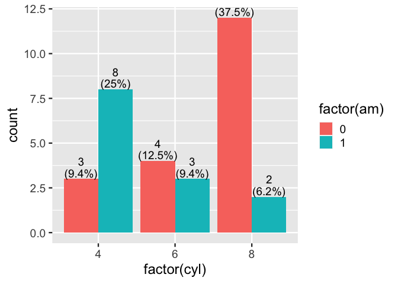
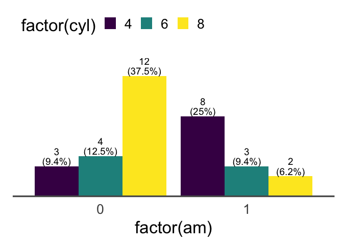

  - [{ggbarlabs}](#ggbarlabs)
      - [Examples](#examples)
  - [How we got here … Composing functions to this
    end](#how-we-got-here--composing-functions-to-this-end)
      - [Step zero: Describing problem using status quo solutions (base
        ggplot)](#step-zero-describing-problem-using-status-quo-solutions-base-ggplot)
          - [bar charts are ubiquitous and can quickly communicate
            information…](#bar-charts-are-ubiquitous-and-can-quickly-communicate-information)
          - [… and bar plots can benefit from specificity of labeling
            …](#-and-bar-plots-can-benefit-from-specificity-of-labeling-)
          - [… but its a pain](#-but-its-a-pain)
      - [Step 2. Rearrange into
        functions](#step-2-rearrange-into-functions)
          - [`geom_barlab_count()`](#geom_barlab_count)
          - [`geom_barlab_count_percent`](#geom_barlab_count_percent)
      - [Complementary functionality
        `ggbarlabs()`](#complementary-functionality-ggbarlabs)
      - [Build `defaults_ggbarlabs` and
        `ggbarlabs()`](#build-defaults_ggbarlabs-and-ggbarlabs)
          - [try it out](#try-it-out-1)
      - [Reflect. Acknowledge short comings, doubts, other good and
        pertanent
        work](#reflect-acknowledge-short-comings-doubts-other-good-and-pertanent-work)
  - [Diamonds Challenge](#diamonds-challenge)
      - [Moving axis labels attempt, but justification-margin dance
        seems very
        fragile…](#moving-axis-labels-attempt-but-justification-margin-dance-seems-very-fragile)
      - [x position as direct label.](#x-position-as-direct-label)

<!-- README.md is generated from README.Rmd. Please edit that file -->

# {ggbarlabs}

<!-- badges: start -->

[](https://lifecycle.r-lib.org/articles/stages.html#experimental)
<!-- badges: end -->

Bar charts are ubiquitous and can quickly communicate information\!
Labeled bar charts provide all the fast, visceral communication of
traditional data visualization with all the specificity of a table.
{ggbarlabs} lets you quickly add labels to geom\_bar().

## Examples

``` r
library(tidyverse)
library(ggbarlabs)
ggplot(mtcars) + 
  aes(x = factor(am)) + 
  geom_bar() + 
  geom_barlab_count()
```


``` r

ggplot(mtcars) + 
  aes(x = factor(am)) + 
  geom_bar() + 
  geom_barlab_count_percent()
```


``` r

last_plot() + 
  ggbarlabs:::defaults_ggbarlabs()
```


# How we got here … Composing functions to this end

## Step zero: Describing problem using status quo solutions (base ggplot)

### bar charts are ubiquitous and can quickly communicate information…

``` r
library(ggplot2)
theme_set(theme_gray(18))
ggplot(mtcars) + 
  aes(x = am) + 
  geom_bar(position = "dodge") 
```


``` r

p <- last_plot()
```

### … and bar plots can benefit from specificity of labeling …

Labeled bar chart is all the fast communication of traditional data
vizualization with all the specificity of a data table.

### … but its a pain

#### either precalc and use geom\_col + geom\_text

🤔 🚧 I’m too lazy to even provide an example.

#### or use verbose after\_stat…

##### first inspecting bar layer (stat\_count)

``` r
layer_data(last_plot(), 1)
#>    y count    prop x flipped_aes PANEL group ymin ymax  xmin xmax colour   fill
#> 1 19    19 0.59375 0       FALSE     1    -1    0   19 -0.45 0.45     NA grey35
#> 2 13    13 0.40625 1       FALSE     1    -1    0   13  0.55 1.45     NA grey35
#>   linewidth linetype alpha
#> 1       0.5        1    NA
#> 2       0.5        1    NA
```

##### then plot

using our knowledge of what data frame results when using StatCount,
refer to the computed var, count

``` r
# count column can be used via after_stat
p +
  geom_text(stat = StatCount, 
            aes(label = after_stat(count)), 
            vjust = -.7)
```


``` r

p + 
  geom_text(stat = StatCount, 
            aes(label = paste0(round(100*after_stat(prop), 1) ,"%")), 
            vjust = -.7)
```


``` r

p + 
  geom_text(stat = StatCount, 
            aes(label = after_stat(
              paste0(count,"\n(",round(100*after_stat(prop), 1) ,"%)")
              )), 
            vjust = -.5, lineheight = .8)
```


``` r


last_plot() + 
  facet_grid(~cyl)
```


``` r

p + 
  geom_text(stat = StatCount, 
            aes(label = after_stat(
              paste0(count,"\n(",round(100*after_stat(prop), 1) ,"%)")
              )), 
            vjust = -.5, lineheight = .8, position = position_dodge2()) + 
  facet_grid(~cyl) + 
  aes(fill = factor(vs))
#> Warning: Width not defined. Set with `position_dodge2(width = ...)`
```


``` r

layer_data(last_plot(), 2)
#> Warning: Width not defined. Set with `position_dodge2(width = ...)`
#>      fill       label  y count      prop x width flipped_aes PANEL group xmin
#> 1 #00BFC4    3\n(30%)  3     3 0.3000000 0   0.9       FALSE     1     2    0
#> 2 #F8766D   1\n(100%)  1     1 1.0000000 1   0.9       FALSE     1     1    1
#> 3 #00BFC4    7\n(70%)  7     7 0.7000000 1   0.9       FALSE     1     2    1
#> 4 #00BFC4   4\n(100%)  4     4 1.0000000 0   0.9       FALSE     2     2    0
#> 5 #F8766D   3\n(100%)  3     3 1.0000000 1   0.9       FALSE     2     1    1
#> 6 #F8766D 12\n(85.7%) 12    12 0.8571429 0   0.9       FALSE     3     1    0
#> 7 #F8766D  2\n(14.3%)  2     2 0.1428571 1   0.9       FALSE     3     1    1
#>   xmax xid newx new_width colour size angle hjust vjust alpha family fontface
#> 1    0   1    0         0  black 3.88     0   0.5  -0.5    NA               1
#> 2    1   2    1         0  black 3.88     0   0.5  -0.5    NA               1
#> 3    1   3    1         0  black 3.88     0   0.5  -0.5    NA               1
#> 4    0   1    0         0  black 3.88     0   0.5  -0.5    NA               1
#> 5    1   2    1         0  black 3.88     0   0.5  -0.5    NA               1
#> 6    0   1    0         0  black 3.88     0   0.5  -0.5    NA               1
#> 7    1   2    1         0  black 3.88     0   0.5  -0.5    NA               1
#>   lineheight
#> 1        0.8
#> 2        0.8
#> 3        0.8
#> 4        0.8
#> 5        0.8
#> 6        0.8
#> 7        0.8
```

## Step 2. Rearrange into functions

### `geom_barlab_count()`

🤔 🚧 likely rewrite, creating new ggproto stat, maybe using
StatCount$compute as start point. This might resolve y label issue which
currently quotes ‘after\_stat()’. See test below.

June Choe, authored the first round ggdirect::geom\_text\_count and
ggdirect::geom\_text\_count\_percent, which proved super useful.

🚧 Main change below is to use vjust for y adjustment rather than
nudge\_y strategy… Any reason to go back? ‘you can use numbers outside
the range (0, 1), but it’s not recommended.’

``` r
#' geom_text_count
#' @description Add label which is the count.  Acts like geom_bar() but text label at the position of the top of the bar.
#'
#' @param vjust vertical justification, either a string (“top”, “middle”, “bottom”, “left”, “center”, “right”) or a number between 0 and 1; you can use numbers outside the range (0, 1), but it’s not recommended.
#' @param position Position adjustment, either as a string, or the result of a call to a position adjustment function. Cannot be jointly specified with nudge_x or nudge_y
#' @param ... Other arguments passed on to layer(). These are often aesthetics, used to set an aesthetic to a fixed value, like colour = "red" or size = 3. They may also be parameters to the paired geom/stat.
#'
#' @return
#' @export
#'
#' @examples
geom_barlab_count <- function(vjust = -0.15, size = 5, position =
                              ggplot2::position_dodge2(width = .9,
                                                       preserve = "single"), ...){

  ggplot2::stat_count(geom = "text",
                      ggplot2::aes(label = ggplot2::after_stat(count)),
                      vjust = vjust, size = size,
                      position = position,
                      ...
  )

}
```

#### Test it out

🤔 🚧 Think about a new example, numeric as categories feels awkward

``` r
library(ggplot2)
ggplot(mtcars) +
   aes(x = factor(cyl)) +
   geom_bar(position = "dodge") +
   geom_barlab_count()
```


``` r

last_plot() + 
  aes(fill = factor(am))
```


### `geom_barlab_count_percent`

🤔 🚧 likely rewrite creating new ggproto stat object. Hopefully this
would allow greater customizability in terms of defining denominator

``` r
#' geom_barlab_count_percent
#' @description Add label which is the count as well as percentage.  Acts like geom_bar() but text label at the position of the top of the bar.  Percentage is calculated within facet panels.
#'
#' @param vjust vertical justification, either a string (“top”, “middle”, “bottom”, “left”, “center”, “right”) or a number between 0 and 1; you can use numbers outside the range (0, 1), but it’s not recommended.
#' @param lineheight single to double spacing is the idea here
#' @param position Position adjustment, either as a string, or the result of a call to a position adjustment function. Cannot be jointly specified with nudge_x or nudge_y
#' @param ... Other arguments passed on to layer(). These are often aesthetics, used to set an aesthetic to a fixed value, like colour = "red" or size = 3. They may also be parameters to the paired geom/stat.
#'
#' @return
#' @export
#'
#' @examples
geom_barlab_count_percent <- function(vjust = -0.1, size = 5,
                                    lineheight = .85,
                                    position = ggplot2::position_dodge2(width = .9,
                                                               preserve = "single"), ...){

  ggplot2::stat_count(geom = "text",
             ggplot2::aes(label = paste0(ggplot2::after_stat(count), "\n(",

                                round(
                                  100*(ggplot2::after_stat(count))/
                                    tapply(ggplot2::after_stat(count),
                                           ggplot2::after_stat(PANEL),
                                           sum)[ggplot2::after_stat(PANEL)],
                                  1), "%)" )),
             vjust = vjust, size = size,
             lineheight = lineheight,
             position = position,
             ...
             )
}
```

#### Try it out

``` r
library(ggplot2)
ggplot(mtcars) +
    aes(x = factor(cyl)) +
    geom_bar(position = "dodge") +
    geom_barlab_count_percent()
```


``` r

last_plot() +
    aes(fill = factor(am))
```



## Complementary functionality `ggbarlabs()`

What if we start with a different set of thematic and scale defaults.
And/or use `+ defaults_ggbarlabs()` to respecify defaults.

🤔 🚧 Consult with some people that think more about these choices and
also who program more with ggplot2::theme()

``` r
ggplot(mtcars) +
  aes(x = factor(cyl)) +
  geom_bar(position = "dodge") +
  geom_barlab_count(nudge_y = .2) +
  theme_classic() +
  theme(axis.line.y = element_blank(),
        axis.text.y.right = element_blank(),
        axis.ticks.y = element_blank(),
        axis.title.y = element_blank(),
        axis.text.y = element_blank(),
        panel.grid.major.y = element_line(color = alpha("gray35", .1)),
        panel.grid.major.x = element_blank(),
        panel.grid.minor.x = element_blank(),
        axis.ticks = element_blank(),
        axis.line.x = element_line(colour = "gray35"),
        legend.position = "top",
        legend.justification = 0) +
  scale_y_continuous(expand = expansion(mult = c(0, .1)))
#> Warning in ggplot2::stat_count(geom = "text", ggplot2::aes(label =
#> ggplot2::after_stat(count)), : Ignoring unknown parameters: `nudge_y`
```


## Build `defaults_ggbarlabs` and `ggbarlabs()`

🤔 🚧 Is `defaults_ggbarlabs` a good name? is providing a different start
point, like `ggbarlabs()`, a good idea? Are there things that need to be
changed about implementation? While we are here, should we think about
changing default color pallets?

``` r
#' Title
#'
#' @return
#' @export
#'
#' @examples
theme_barlabs <- function(base_size = 25, ...){
  
  theme_classic(base_size = base_size, ...)  %+replace%
  theme(axis.line.y = element_blank(),
        axis.text.y.right = element_blank(),
        axis.ticks.y = element_blank(),
        axis.title.y = element_blank(),
        axis.text.y = element_blank(),
        panel.grid.major.y = element_line(color = alpha("gray35", .1)),
        panel.grid.major.x = element_blank(),
        panel.grid.minor.x = element_blank(),
        axis.ticks = element_blank(),
        axis.line.x = element_line(colour = "gray35"),
        legend.position = "top",
        legend.justification = 0, 
        complete = TRUE
        )
}
```

``` r
#' Title
#'
#' @return
#' @export
#'
#' @examples
scale_y_barlabs <- function(...){
    ggplot2::scale_y_continuous(expand = expansion(mult = c(0, .15)), ...)
}
```

``` r
#' Title
#'
#' @return
#' @export
#'
#' @examples
scale_fill_barlabs <- function(...){
    ggplot2::scale_fill_viridis_d(...)
}
```

``` r
#' Title
#'
#' @return
#'
#' @examples
defaults_barlabs <- function(){
  
  list(theme_barlabs(),
       scale_y_barlabs(), 
       scale_fill_barlabs()
       )
}


#' Title
#'
#' @param data 
#' @param ... 
#'
#' @return
#' @export
#'
#' @examples
ggbarlabs <- function(data = NULL, ...){
  ggplot(data = data , ... ) +
  defaults_barlabs()
}
```

#### try it out

``` r
ggplot(mtcars) + 
  aes(x = factor(am)) + 
  geom_bar(fill = alpha("navy", .9)) + 
  geom_barlab_count_percent() + 
  theme_barlabs() + 
  scale_y_barlabs() + 
  scale_fill_barlabs()
```


``` r

ggplot(mtcars) + 
  aes(x = factor(am)) + 
  geom_bar(fill = alpha("navy", .9)) + 
  geom_barlab_count_percent() + 
  defaults_barlabs()  # will be not exported?
```


``` r

# or
ggbarlabs(mtcars) + 
  aes(x = factor(am), fill = factor(cyl)) + 
  geom_bar(position = "dodge") + 
  geom_barlab_count_percent()
```



``` r

# or
ggplot(mtcars) + 
  aes(x = factor(am), fill = factor(cyl)) + 
  geom_bar(position = "dodge") + 
  geom_barlab_count(vjust = 1.7,
                    color = "grey98")
```


## Reflect. Acknowledge short comings, doubts, other good and pertanent work

  - percents is calculated within panel. We might want to specify the
    ‘whole’ from which percentage is calculated.
  - Horizontal bars
  - stacked barchart support (seems trickier, esp when bars are short)
  - labels within bars… (trickier - when bars are short)

# Diamonds Challenge

## Moving axis labels attempt, but justification-margin dance seems very fragile…

<https://stackoverflow.com/questions/55406829/ggplot-put-axis-text-inside-plot>

``` r
library(tidyverse)
ggplot2::diamonds %>%
  ggplot() + 
  aes(x = fct_infreq(cut) %>% fct_rev()) + 
  geom_bar(width = .5) + 
  coord_flip() + 
  stat_count(geom = "text", 
             aes(label = after_stat(count), 
                 hjust = after_stat(ifelse(count>2000, 1.2, -.2)),
                 color = after_stat(count>2000))) + 
  scale_color_manual(values = c("white", "grey25") %>% rev()) +
  scale_y_continuous(expand = expansion(mult = c(0, .1))) + 
  theme(axis.text.y = element_text(hjust = 0, vjust = -2.75,
                                 margin = margin(l = 27, r = -45)),
        axis.ticks = element_blank()) + 
  aes(fill = cut == "Ideal") +
  scale_fill_manual(values = c("darkgrey", "midnightblue"))
```


## x position as direct label.

But x becomes numeric, so we have to put the category back on. Right now
seems fragile - but if we can recover cut\_types at a ‘before\_stat’ or
something, that would be pretty cool. The coord\_flip() makes everything
feel confusing to talk about. lol.

``` r
cut_types <- levels(ggplot2::diamonds$cut)

ggplot2::diamonds %>%
  ggplot() + 
  aes(x = fct_infreq(cut) %>% fct_rev()) + 
  geom_bar(width = .5) + 
  coord_flip() + 
  stat_count(geom = "text", 
             aes(label = after_stat(count), 
                 hjust = after_stat(ifelse(count>2000, 1.2, -.2)),
                 color = after_stat(count>2000))) + 
  scale_color_manual(values = c("white", "grey25") %>% rev()) +
  stat_count(geom = "text", y = 0,
             aes(label = after_stat(x) %>% 
                   factor(level = 1:5, 
                          labels = cut_types),
                 hjust = 0,
                 vjust = -2.5)) + 
  aes(fill = cut == "Ideal") +
  scale_fill_manual(values = c("darkgrey", "midnightblue"))
```


``` r

last_plot() + 
  theme_void() + 
  guides(fill = "none", color= "none")
```


