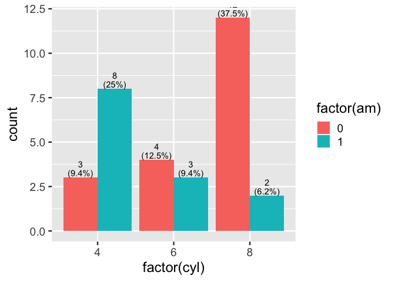
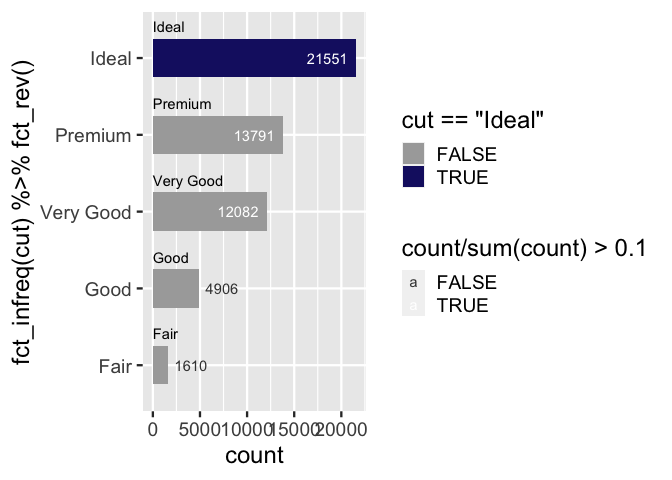
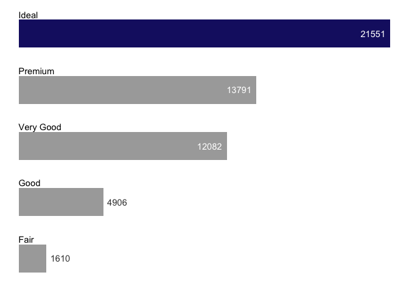

  - [ggbarlabs](#ggbarlabs)
  - [Part 1. Addressing a problem with new
    functionality](#part-1-addressing-a-problem-with-new-functionality)
      - [Describing problem](#describing-problem)
          - [bar charts are ubiquitous and can quickly communicate
            information…](#bar-charts-are-ubiquitous-and-can-quickly-communicate-information)
          - [… and bar plots can benefit from specificity of labeling
            …](#-and-bar-plots-can-benefit-from-specificity-of-labeling-)
          - [… but its a pain](#-but-its-a-pain)
      - [What
        if…`ggbarlabs::geom_barlab_count()`\!](#what-ifggbarlabsgeom_barlab_count)
          - [Proposed User interface](#proposed-user-interface)
      - [Composing functions to this
        end](#composing-functions-to-this-end)
          - [`geom_barlab_count()`](#geom_barlab_count)
          - [`geom_barlab_count_percent`](#geom_barlab_count_percent)
      - [Complementary functionality
        `ggbarlabs()`](#complementary-functionality-ggbarlabs)
      - [Build `defaults_ggbarlabs` and
        `ggbarlabs()`](#build-defaults_ggbarlabs-and-ggbarlabs)
          - [try it out](#try-it-out-1)
      - [Reflect. Acknowledge short comings, doubts, other good and
        pertanante
        work](#reflect-acknowledge-short-comings-doubts-other-good-and-pertanante-work)
  - [Part 2. Packaging and
    documentation](#part-2-packaging-and-documentation)
      - [minimal requirements for github package. Have
        you:](#minimal-requirements-for-github-package-have-you)
          - [Created files for package archetecture with
            `devtools::create("./ggbarlabs")`
            ✅](#created-files-for-package-archetecture-with-devtoolscreateggbarlabs-)
          - [Moved functions R folder? ✅](#moved-functions-r-folder-)
          - [Added roxygen skeleton? ✅](#added-roxygen-skeleton-)
          - [Managed dependencies ? ✅](#managed-dependencies--)
          - [Chosen a license? ✅](#chosen-a-license-)
          - [Run `devtools::check()` and addressed errors?
            ✅](#run-devtoolscheck-and-addressed-errors-)
      - [Listen 🚧](#listen-)
          - [Consulted with potential users
            🚧](#consulted-with-potential-users-)
          - [Consulted with technical
            experts](#consulted-with-technical-experts)
      - [Polish. Have you.](#polish-have-you)
          - [Settled on examples and put them in the roxygen skeleton?
            🚧](#settled-on-examples-and-put-them-in-the-roxygen-skeleton-)
          - [Written formal tests of functions?
            🚧](#written-formal-tests-of-functions-)
          - [Sent tests in this readme to package via readme2pkg
            🚧](#sent-tests-in-this-readme-to-package-via-readme2pkg-)
          - [Have you worked added a description and author information
            in the DESCRIPTION file?
            🚧](#have-you-worked-added-a-description-and-author-information-in-the-description-file-)
          - [Addressed *all* notes, warnings and errors.
            🚧](#addressed-all-notes-warnings-and-errors-)
      - [Promote](#promote)
          - [Package website built? 🚧](#package-website-built-)
          - [Package website deployed? 🚧](#package-website-deployed-)
      - [Harden](#harden)
          - [Submit to CRAN? 🚧](#submit-to-cran-)
  - [Reports, Environment](#reports-environment)
      - [Description file extract](#description-file-extract)
      - [Environment](#environment)
      - [`devtools::check()` report](#devtoolscheck-report)

<!-- README.md is generated from README.Rmd. Please edit that file -->

# ggbarlabs

<!-- badges: start -->

<!-- badges: end -->

# Part 1. Addressing a problem with new functionality

## Describing problem

### bar charts are ubiquitous and can quickly communicate information…

``` r
library(ggplot2)
theme_set(theme_gray(18))
ggplot(mtcars) + 
  aes(x = am) + 
  geom_bar() 
```


``` r

p <- last_plot()
```

### … and bar plots can benefit from specificity of labeling …

Labeled bar chart is all the fast communication of traditional data
vizualization with all the specificity of a data table.

### … but its a pain

#### either precalc and use geom\_col + geom\_text

🤔 🚧 I’m too lazy to even provide an example.

#### or use verbose after\_stat…

##### first inspecting bar layer (stat\_count)

``` r
layer_data(last_plot(), 1)
#>    y count    prop x flipped_aes PANEL group ymin ymax  xmin xmax colour   fill
#> 1 19    19 0.59375 0       FALSE     1    -1    0   19 -0.45 0.45     NA grey35
#> 2 13    13 0.40625 1       FALSE     1    -1    0   13  0.55 1.45     NA grey35
#>   linewidth linetype alpha
#> 1       0.5        1    NA
#> 2       0.5        1    NA
```

##### then plot

using our knowledge of what data frame results when using StatCount,
refer to the computed var, count

``` r
# count column can be used via after_stat
p +
  geom_text(stat = StatCount, 
            aes(label = after_stat(count)), 
            vjust = -.7)
```


``` r

p + 
  geom_text(stat = StatCount, 
            aes(label = after_stat(
              paste0(round(100*count/sum(count), 1) ,"%")
              )), 
            vjust = -.7)
```


``` r

p + 
  geom_text(stat = StatCount, 
            aes(label = after_stat(
              paste0(count,"\n(",round(100*count/sum(count), 1) ,"%)")
              )), 
            vjust = -.5, lineheight = .8)
```


``` r

layer_data(last_plot(), 2)
#>         label  y count    prop x width flipped_aes PANEL group colour size
#> 1 19\n(59.4%) 19    19 0.59375 0   0.9       FALSE     1    -1  black 3.88
#> 2 13\n(40.6%) 13    13 0.40625 1   0.9       FALSE     1    -1  black 3.88
#>   angle hjust vjust alpha family fontface lineheight
#> 1     0   0.5  -0.5    NA               1        0.8
#> 2     0   0.5  -0.5    NA               1        0.8
```

## What if…`ggbarlabs::geom_barlab_count()`\!

### Proposed User interface

``` r
ggplot(mtcars) + 
  aes(x = am) + 
  geom_bar() + 
  geom_barlab_count()

ggplot(mtcars) + 
  aes(x = am) + 
  geom_bar() + 
  geom_barlab_count_percent()
```

## Composing functions to this end

### `geom_barlab_count()`

🤔 🚧 likely rewrite, creating new ggproto stat, maybe using
StatCount$compute as start point. This might resolve y label issue which
currently quotes ‘after\_stat()’. See test below.

June Choe, authored the first round ggdirect::geom\_text\_count and
ggdirect::geom\_text\_count\_percent, which proved super useful.

🚧 Main change below is to use vjust for y adjustment rather than
nudge\_y strategy… Any reason to go back? ‘you can use numbers outside
the range (0, 1), but it’s not recommended.’

``` r
#' geom_text_count
#' @description Add label which is the count.  Acts like geom_bar() but text label at the position of the top of the bar.
#'
#' @param vjust vertical justification, either a string (“top”, “middle”, “bottom”, “left”, “center”, “right”) or a number between 0 and 1; you can use numbers outside the range (0, 1), but it’s not recommended.
#' @param position Position adjustment, either as a string, or the result of a call to a position adjustment function. Cannot be jointly specified with nudge_x or nudge_y
#' @param ... Other arguments passed on to layer(). These are often aesthetics, used to set an aesthetic to a fixed value, like colour = "red" or size = 3. They may also be parameters to the paired geom/stat.
#'
#' @return
#' @export
#'
#' @examples
geom_barlab_count <- function(vjust = -0.15, position =
                              ggplot2::position_dodge2(width = .9,
                                                       preserve = "single"), ...){

  ggplot2::stat_count(geom = "text",
                      ggplot2::aes(label = ggplot2::after_stat(count)),
                      vjust = vjust,
                      position = position,
                      ...
  )

}
```

#### Test it out

🤔 🚧 Think about a new example, numeric as categories feels awkward

``` r
library(ggplot2)
ggplot(mtcars) +
   aes(x = factor(cyl)) +
   geom_bar(position = "dodge") +
   geom_barlab_count()
```


``` r

last_plot() + 
  aes(fill = factor(am))
```



### `geom_barlab_count_percent`

🤔 🚧 likely rewrite creating new ggproto stat object. Hopefully this
would allow greater customizability in terms of defining denominator

``` r
#' geom_barlab_count_percent
#' @description Add label which is the count as well as percentage.  Acts like geom_bar() but text label at the position of the top of the bar.  Percentage is calculated within facet panels.
#'
#' @param vjust vertical justification, either a string (“top”, “middle”, “bottom”, “left”, “center”, “right”) or a number between 0 and 1; you can use numbers outside the range (0, 1), but it’s not recommended.
#' @param lineheight single to double spacing is the idea here
#' @param position Position adjustment, either as a string, or the result of a call to a position adjustment function. Cannot be jointly specified with nudge_x or nudge_y
#' @param ... Other arguments passed on to layer(). These are often aesthetics, used to set an aesthetic to a fixed value, like colour = "red" or size = 3. They may also be parameters to the paired geom/stat.
#'
#' @return
#' @export
#'
#' @examples
geom_barlab_count_percent <- function(vjust = -0.1,
                                    lineheight = .85,
                                    position = ggplot2::position_dodge2(width = .9,
                                                               preserve = "single"), ...){

  ggplot2::stat_count(geom = "text",
             ggplot2::aes(label = paste0(ggplot2::after_stat(count), "\n(",

                                round(
                                  100*(ggplot2::after_stat(count))/
                                    tapply(ggplot2::after_stat(count),
                                           ggplot2::after_stat(PANEL),
                                           sum)[ggplot2::after_stat(PANEL)],
                                  1), "%)" )),
             vjust = vjust,
             lineheight = lineheight,
             position = position,
             ...
             )
}
```

#### Try it out

``` r
library(ggplot2)
ggplot(mtcars) +
    aes(x = factor(cyl)) +
    geom_bar(position = "dodge") +
    geom_barlab_count_percent()
```


``` r

last_plot() +
    aes(fill = factor(am))
```


## Complementary functionality `ggbarlabs()`

What if we start with a different set of thematic and scale defaults.
And/or use `+ defaults_ggbarlabs()` to respecify defaults.

🤔 🚧 Consult with some people that think more about these choices and
also who program more with ggplot2::theme()

``` r
ggplot(mtcars) +
  aes(x = factor(cyl)) +
  geom_bar(position = "dodge") +
  geom_barlab_count(nudge_y = .2) +
  theme_classic() +
  theme(axis.line.y = element_blank(),
        axis.text.y.right = element_blank(),
        axis.ticks.y = element_blank(),
        axis.title.y = element_blank(),
        axis.text.y = element_blank(),
        panel.grid.major.y = element_line(color = alpha("gray35", .1)),
        panel.grid.major.x = element_blank(),
        panel.grid.minor.x = element_blank(),
        axis.ticks = element_blank(),
        axis.line.x = element_line(colour = "gray35"),
        legend.position = "top",
        legend.justification = 0) +
  scale_y_continuous(expand = expansion(mult = c(0, .1)))
#> Warning in ggplot2::stat_count(geom = "text", ggplot2::aes(label =
#> ggplot2::after_stat(count)), : Ignoring unknown parameters: `nudge_y`
```


## Build `defaults_ggbarlabs` and `ggbarlabs()`

🤔 🚧 Is `defaults_ggbarlabs` a good name? is providing a different start
point, like `ggbarlabs()`, a good idea? Are there things that need to be
changed about implementation? While we are here, should we think about
changing default color pallets?

``` r
defaults_ggbarlabs <- function(){
  
  list(
  theme_classic(base_size = 15) ,
  theme(axis.line.y = element_blank(),
        axis.text.y.right = element_blank(),
        axis.ticks.y = element_blank(),
        axis.title.y = element_blank(),
        axis.text.y = element_blank(),
        panel.grid.major.y = element_line(color = alpha("gray35", .1)),
        panel.grid.major.x = element_blank(),
        panel.grid.minor.x = element_blank(),
        axis.ticks = element_blank(),
        axis.line.x = element_line(colour = "gray35"),
        legend.position = "top",
        legend.justification = 0) ,
  scale_y_continuous(expand = expansion(mult = c(0, .15))))
}


ggbarlabs <- function(data = NULL, ...){
  ggplot(data= data , ... ) +
  defaults_ggbarlabs()
}
```

#### try it out

``` r
ggplot(mtcars) + 
  aes(x = factor(am)) + 
  geom_bar(fill = alpha("navy", .9)) + 
  geom_barlab_count_percent() + 
  defaults_ggbarlabs()
```



``` r

# or
ggbarlabs(mtcars) + 
  aes(x = factor(am), fill = factor(cyl)) + 
  geom_bar(position = "dodge") + 
  geom_barlab_count_percent()
```



## Reflect. Acknowledge short comings, doubts, other good and pertanante work

  - percents is calculated within panel. We might want to specify the
    ‘whole’ from which percentage is calculated.
  - Horizontal bars
  - stacked barchart support (seems trickier, esp when bars are short)
  - labels within bars… (trickier - when bars are short)

# Part 2. Packaging and documentation

checklist 🚧 ✅

## minimal requirements for github package. Have you:

### Created files for package archetecture with `devtools::create("./ggbarlabs")` ✅

### Moved functions R folder? ✅

``` r
knitr::knit_code$get() |> names()
#>  [1] "unnamed-chunk-1"           "unnamed-chunk-2"          
#>  [3] "unnamed-chunk-3"           "unnamed-chunk-4"          
#>  [5] "unnamed-chunk-5"           "unnamed-chunk-6"          
#>  [7] "unnamed-chunk-7"           "unnamed-chunk-8"          
#>  [9] "geom_barlab_count"         "unnamed-chunk-9"          
#> [11] "geom_barlab_count_percent" "unnamed-chunk-10"         
#> [13] "unnamed-chunk-11"          "defaults_ggbarlabs"       
#> [15] "unnamed-chunk-12"          "unnamed-chunk-13"         
#> [17] "unnamed-chunk-14"          "unnamed-chunk-15"         
#> [19] "unnamed-chunk-16"          "unnamed-chunk-17"         
#> [21] "unnamed-chunk-18"
```

``` r
library(readme2pkg)
chunk_to_r("geom_barlab_count")
chunk_to_r("geom_barlab_count_percent")
```

### Added roxygen skeleton? ✅

for auto documentation and making sure proposed functions are *exported*

### Managed dependencies ? ✅

package dependancies managed, i.e. `depend::function()` in proposed
functions and declared in the DESCRIPTION

### Chosen a license? ✅

``` r
usethis::use_package("ggplot2")
usethis::use_mit_license()
```

### Run `devtools::check()` and addressed errors? ✅

## Listen 🚧

### Consulted with potential users 🚧

### Consulted with technical experts

Getting started with that\!

## Polish. Have you.

### Settled on examples and put them in the roxygen skeleton? 🚧

### Written formal tests of functions? 🚧

### Sent tests in this readme to package via readme2pkg 🚧

That would look like this…

    chunk_to_tests_testthat("test_geom_barlab_count")

### Have you worked added a description and author information in the DESCRIPTION file? 🚧

### Addressed *all* notes, warnings and errors. 🚧

## Promote

### Package website built? 🚧

### Package website deployed? 🚧

## Harden

### Submit to CRAN? 🚧

# Reports, Environment

## Description file extract

## Environment

Here I just want to print the packages and the versions

``` r
all <- sessionInfo() |> print() |> capture.output()
all[11:17]
#> [1] ""                                                                         
#> [2] "attached base packages:"                                                  
#> [3] "[1] stats     graphics  grDevices utils     datasets  methods   base     "
#> [4] ""                                                                         
#> [5] "other attached packages:"                                                 
#> [6] "[1] readme2pkg_0.0.0.9000 ggplot2_3.4.1        "                          
#> [7] ""
```

## `devtools::check()` report

``` r
# rm(list = c("geom_barlab_count", "geom_barlab_count_percent"))
devtools::check(pkg = ".")
#> ══ Documenting ═════════════════════════════════════════════════════════════════
#> ℹ Updating ggbarlabs documentation
#> ℹ Loading ggbarlabs
#> Warning: ── Conflicts ──────────────────────────────────────────── ggbarlabs conflicts
#> ──
#> ✖ `geom_barlab_count` masks `ggbarlabs::geom_barlab_count()`.
#> ✖ `geom_barlab_count_percent` masks `ggbarlabs::geom_barlab_count_percent()`.
#> ℹ Did you accidentally source a file rather than using `load_all()`?
#>   Run `rm(list = c("geom_barlab_count", "geom_barlab_count_percent"))` to
#>   remove the conflicts.
#> Warning: [geom_barlab_count.R:8] @return requires a value
#> Warning: [geom_barlab_count.R:11] @examples requires a value
#> Warning: [geom_barlab_count_percent.R:9] @return requires a value
#> Warning: [geom_barlab_count_percent.R:12] @examples requires a value
#> 
#> ══ Building ════════════════════════════════════════════════════════════════════
#> Setting env vars:
#> • CFLAGS    : -Wall -pedantic
#> • CXXFLAGS  : -Wall -pedantic
#> • CXX11FLAGS: -Wall -pedantic
#> • CXX14FLAGS: -Wall -pedantic
#> • CXX17FLAGS: -Wall -pedantic
#> • CXX20FLAGS: -Wall -pedantic
#> ── R CMD build ─────────────────────────────────────────────────────────────────
#> * checking for file ‘/Users/evangelinereynolds/Google Drive/r_packages/ggbarlabs/DESCRIPTION’ ... OK
#> * preparing ‘ggbarlabs’:
#> * checking DESCRIPTION meta-information ... OK
#> * checking for LF line-endings in source and make files and shell scripts
#> * checking for empty or unneeded directories
#> * building ‘ggbarlabs_0.0.0.9000.tar.gz’
#> 
#> ══ Checking ════════════════════════════════════════════════════════════════════
#> Setting env vars:
#> • _R_CHECK_CRAN_INCOMING_REMOTE_               : FALSE
#> • _R_CHECK_CRAN_INCOMING_                      : FALSE
#> • _R_CHECK_FORCE_SUGGESTS_                     : FALSE
#> • _R_CHECK_PACKAGES_USED_IGNORE_UNUSED_IMPORTS_: FALSE
#> • NOT_CRAN                                     : true
#> ── R CMD check ─────────────────────────────────────────────────────────────────
#> * using log directory ‘/private/var/folders/zy/vfmj60bs3zv6r_2dsk18_vj00000gn/T/RtmpACWd1q/file8f1037d958e6/ggbarlabs.Rcheck’
#> * using R version 4.2.2 (2022-10-31)
#> * using platform: x86_64-apple-darwin17.0 (64-bit)
#> * using session charset: UTF-8
#> * using options ‘--no-manual --as-cran’
#> * checking for file ‘ggbarlabs/DESCRIPTION’ ... OK
#> * this is package ‘ggbarlabs’ version ‘0.0.0.9000’
#> * package encoding: UTF-8
#> * checking package namespace information ... OK
#> * checking package dependencies ... OK
#> * checking if this is a source package ... OK
#> * checking if there is a namespace ... OK
#> * checking for executable files ... OK
#> * checking for hidden files and directories ... OK
#> * checking for portable file names ... OK
#> * checking for sufficient/correct file permissions ... OK
#> * checking serialization versions ... OK
#> * checking whether package ‘ggbarlabs’ can be installed ... OK
#> * checking installed package size ... OK
#> * checking package directory ... OK
#> * checking for future file timestamps ... OK
#> * checking DESCRIPTION meta-information ... OK
#> * checking top-level files ... OK
#> * checking for left-over files ... OK
#> * checking index information ... OK
#> * checking package subdirectories ... OK
#> * checking R files for non-ASCII characters ... OK
#> * checking R files for syntax errors ... OK
#> * checking whether the package can be loaded ... OK
#> * checking whether the package can be loaded with stated dependencies ... OK
#> * checking whether the package can be unloaded cleanly ... OK
#> * checking whether the namespace can be loaded with stated dependencies ... OK
#> * checking whether the namespace can be unloaded cleanly ... OK
#> * checking loading without being on the library search path ... OK
#> * checking dependencies in R code ... OK
#> * checking S3 generic/method consistency ... OK
#> * checking replacement functions ... OK
#> * checking foreign function calls ... OK
#> * checking R code for possible problems ... NOTE
#> geom_barlab_count: no visible binding for global variable ‘count’
#> geom_barlab_count_percent: no visible binding for global variable
#>   ‘count’
#> geom_barlab_count_percent: no visible binding for global variable
#>   ‘PANEL’
#> Undefined global functions or variables:
#>   PANEL count
#> * checking Rd files ... OK
#> * checking Rd metadata ... OK
#> * checking Rd line widths ... OK
#> * checking Rd cross-references ... OK
#> * checking for missing documentation entries ... OK
#> * checking for code/documentation mismatches ... OK
#> * checking Rd \usage sections ... OK
#> * checking Rd contents ... OK
#> * checking for unstated dependencies in examples ... OK
#> * checking examples ... NONE
#> * checking for non-standard things in the check directory ... OK
#> * checking for detritus in the temp directory ... OK
#> * DONE
#> 
#> Status: 1 NOTE
#> See
#>   ‘/private/var/folders/zy/vfmj60bs3zv6r_2dsk18_vj00000gn/T/RtmpACWd1q/file8f1037d958e6/ggbarlabs.Rcheck/00check.log’
#> for details.
#> ── R CMD check results ─────────────────────────────── ggbarlabs 0.0.0.9000 ────
#> Duration: 25.2s
#> 
#> ❯ checking R code for possible problems ... NOTE
#>   geom_barlab_count: no visible binding for global variable ‘count’
#>   geom_barlab_count_percent: no visible binding for global variable
#>     ‘count’
#>   geom_barlab_count_percent: no visible binding for global variable
#>     ‘PANEL’
#>   Undefined global functions or variables:
#>     PANEL count
#> 
#> 0 errors ✔ | 0 warnings ✔ | 1 note ✖
```
